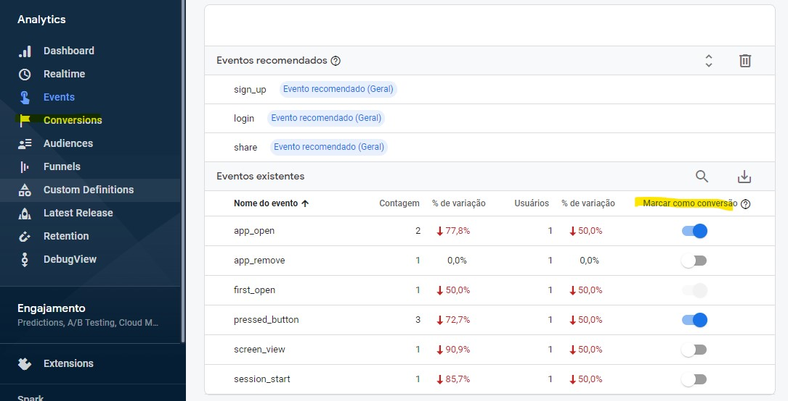
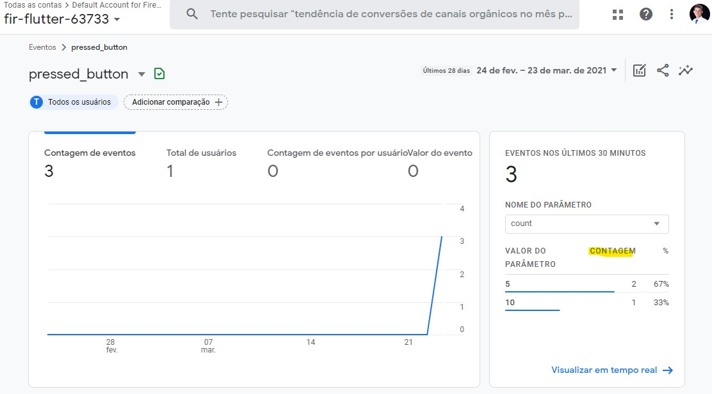
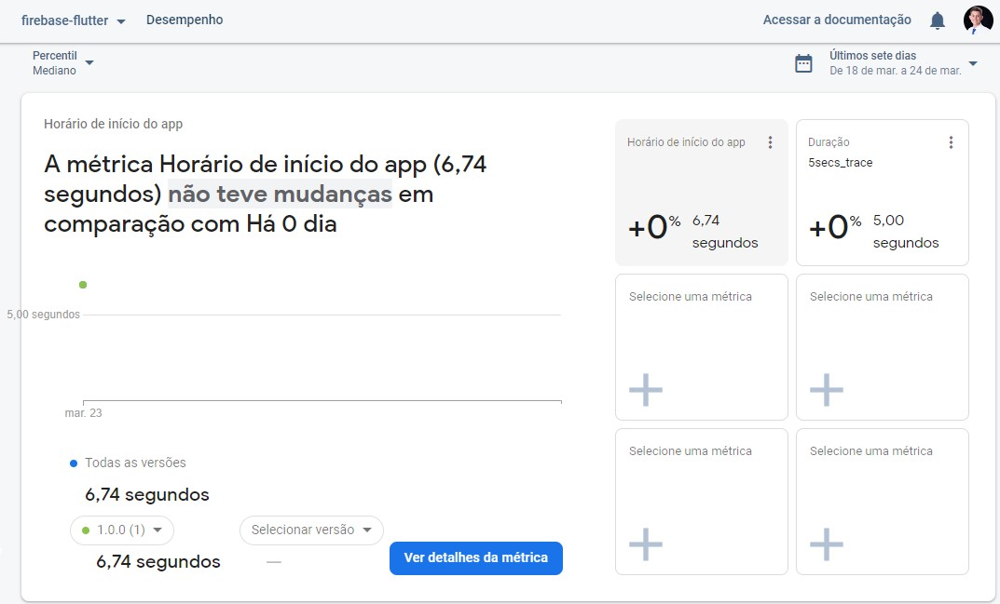

# firebase_flutter


## Analytics

### Logs

São uma forma que registrar eventos com parâmetros internos ao app. Basta dar um nome e registrar o evento com `logEvent()`. Opcionalmente pode-se enviar informaçõesao Firebase via parâmetros, como visto a seguir:
```dart
final analytics = FirebaseAnalytics();

analytics.logEvent(name: 'pressed_button', parameters: params).then(
  (value) => print('analytics.logEvent($params)'),
);
```

Podemos criar eventos que ativam quando resposta do servidor não está no padrão esperado, como se fosse um `assert`.

Existem log pré-programados, prontos para serem usados e que não podem ser alterados. A lista dos eventos já disponíveis para uso encontra-se na [documentação do Firebase](https://firebase.google.com/docs/reference/android/com/google/firebase/analytics/FirebaseAnalytics.Event.html#APP_OPEN). Abaixo, um exemplo com o `app_open`:

```dart
analyticsAppOpen() {
  analytics.logAppOpen().then((value) => print('analytics.logAppOpen()'));
}
```

Eventos:


Métricas personalizadas: 



## Performance

### Crashlytics

A mais leve e eficiente solução de geração de relatórios de erros. Crashlytics nos ajuda em 3 aspectos:
- **Logs**: Erros e Exceções são registrados como eventos

- **Crash reports**: Relatório do erro é enviado quando o app é reiniciado após cada erro
- **Stack traces**: Se um app se recuperar de um erro, Dart Stack trace ainda emite um relatório do ocorrido

Importante: se a falha fizer o App fechar inesperadamente, o relatório será automaticamente enviado apenas na sua **próxima inicialização**.

Pegando todas as exceções não tratadas:
```dart


void main() {
  // Pass all uncaught errors from the framework to Crashlytics.
  FlutterError.onError = FirebaseCrashlytics.instance.recordFlutterError;

  runApp(MyApp());
}
```

Podemos associar os erros a um par chave-valor. É possível adicionar até 64 chaves-valores. Ambos podem conter até 1024 caracteres cada.
```dart
// Set a key to a string.
FirebaseCrashlytics.instance.setCustomKey('str_key', 'hello');

// Set a key to a boolean.
FirebaseCrashlytics.instance.setCustomKey('bool_key', true);

// Set a key to an int.
FirebaseCrashlytics.instance.setCustomKey('int_key', 1);

// also long, float and double...
```

É possível adicionar um id pro usuário com:
```dart
FirebaseCrashlytics.instance.setUserIdentifier("12345");
```

Para criar uma mensagem persolanizada:
```dart
FirebaseCrashlytics.instance.log("Higgs-Boson detected! Bailing out");
```


Referências:
- [Alura](https://www.alura.com.br/artigos/tratamento-de-execucoes-com-firebase-crashlytics)
- [Flutter Dev Medium](https://medium.com/flutterdevs/crashlytics-in-flutter-bf2af198b382)
- [FlutterFire](https://firebase.flutter.dev/docs/crashlytics/usage/)


### Rasteamento (tracing):
Para aplicativos iOS e Android, o Monitoramento de Desempenho coleta **automaticamente** vários rastros relacionados ao ciclo de vida do aplicativo. São eles:

- **Início de aplicativo**: mede o tempo entre o momento em que o usuário abre o aplicativo e o momento em que o aplicativo responde.

- **Aplicativo em primeiro plano**: mede o tempo em que o aplicativo está sendo executado em primeiro plano e disponível para o usuário.

- **Aplicativo em segundo plano**: mede o tempo em que o aplicativo está sendo executado em segundo plano.

Esses rastreios são rastros prontos para uso, portanto, você não pode adicionar métricas personalizadas ou atributos personalizados a eles. Todos esses rastreios são como cronômetros porque medem o tempo que leva para o processo monitorado ser executado. [Fonte](https://firebase.google.com/docs/perf-mon/app-start-foreground-background-traces?platform=android).


Rasteamento personalizado:
```dart
_perfTrace() async {
    final trace = FirebasePerformance.instance.newTrace('5secs_trace');
    trace.start();
    await Future.delayed(Duration(seconds: 5));
    trace.stop();
  }
```
Mede tempo entre os comandos `trace.start()` e `trace.stop()`.

No console: 


### Network performance

Rastreia o tempo que as requisições levam para completarem-se, a taxa de erro e também registra as informações no body e header. 

Firebase ainda [não oferece](https://stackoverflow.com/a/54272558/9718711) essa funcionalidade por padrão nem no FLutter nem no Dio. É possível adiconar essa funcionalidade programaticamente usando o código disponível na documentação do [firebase_performance](https://pub.dev/packages/firebase_performance). Há [esse pacote](https://pub.dev/packages/dio_firebase_performance) que tenta fazer a mesma coisa utilizando o Dio, mas não é seguro adicioná-lo.


## Apêndice:

Vários pacotes do Flutter Firebase estão exibindo alertas de depreciação. Até o momento eles não interferem no build nem execução. Para saber mais, [ver issue no repositório](https://github.com/FirebaseExtended/flutterfire/issues/3876).